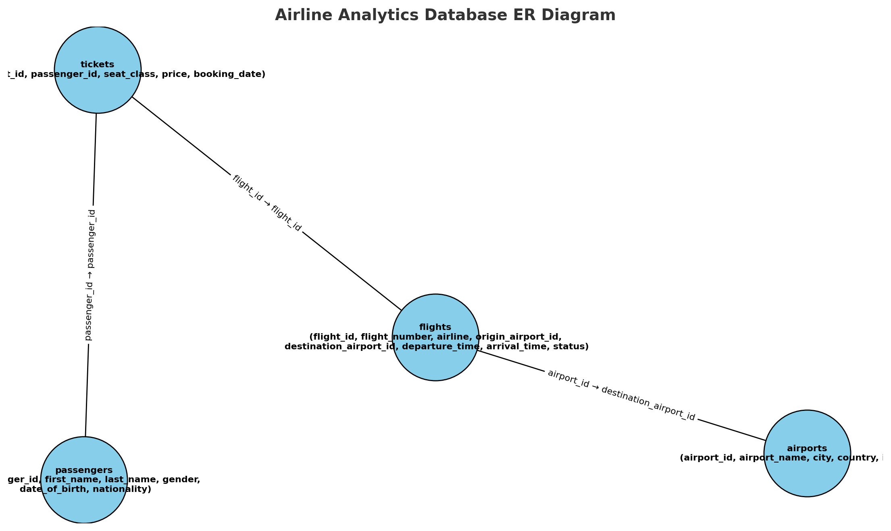

# **Advanced Airline Analytics – SQL Project**

## **Project Overview**

This project demonstrates advanced SQL skills using a simulated airline operations dataset.
It covers **data analysis**, **report generation**, and **business insights** for the airline industry.
The focus is on **complex joins**, **window functions**, **CTEs**, **aggregate queries**, and **performance tuning**.

---

## **Dataset Description**

The dataset consists of **four CSV files**:

### **1. airports.csv**

| Column         | Description                          |
| -------------- | ------------------------------------ |
| `airport_id`   | Unique numeric ID for each airport   |
| `airport_name` | Full official airport name           |
| `city`         | City where the airport is located    |
| `country`      | Country where the airport is located |
| `iata_code`    | 3-letter IATA code                   |

---

### **2. flights.csv**

| Column                   | Description                                       |
| ------------------------ | ------------------------------------------------- |
| `flight_id`              | Unique numeric ID for each flight                 |
| `airline`                | Airline operating the flight                      |
| `origin_airport_id`      | Departure airport ID (FK → airports.csv)          |
| `destination_airport_id` | Arrival airport ID (FK → airports.csv)            |
| `departure_time`         | Scheduled departure date/time                     |
| `arrival_time`           | Scheduled arrival date/time                       |
| `status`                 | Flight status (`On Time`, `Delayed`, `Cancelled`) |
| `distance`               | Distance in miles                                 |

---

### **3. passengers.csv**

| Column         | Description                          |
| -------------- | ------------------------------------ |
| `passenger_id` | Unique numeric ID for each passenger |
| `first_name`   | Passenger’s first name               |
| `last_name`    | Passenger’s last name                |
| `gender`       | Gender (`Male`, `Female`, `Other`)   |
| `dob`          | Date of birth                        |
| `nationality`  | Passenger’s nationality              |

---

### **4. tickets.csv**

| Column           | Description                                     |
| ---------------- | ----------------------------------------------- |
| `ticket_id`      | Unique numeric ID for each ticket               |
| `passenger_id`   | Passenger ID (FK → passengers.csv)              |
| `flight_id`      | Flight ID (FK → flights.csv)                    |
| `seat_class`     | Ticket class (`Economy`, `Business`, `First`)   |
| `price`          | Ticket price in USD                             |
| `booking_date`   | Booking date                                    |
| `payment_status` | Payment status (`Paid`, `Pending`, `Cancelled`) |

---

## **Entity Relationship Diagrams (ERD)**



---

## **Project Objectives**

* Track **flight performance** (on-time %, delays, cancellations)
* Identify **top revenue-generating routes**
* Analyze **passenger booking patterns**
* Study **seasonal trends in ticket sales**
* Detect **high-value customers**
* Provide **data-driven recommendations**

---

## **🛠 Tools & Technologies**

* **Database:** MySQL / PostgreSQL
* **Data Import:** CSV to SQL using `LOAD DATA` or GUI tools (DBeaver, MySQL Workbench)
* **SQL Concepts Used:**

  * INNER JOIN, LEFT JOIN, SELF JOIN
  * Common Table Expressions (CTEs)
  * Window Functions (`ROW_NUMBER`, `RANK`, `LAG`, `LEAD`)
  * Aggregate Functions (`SUM`, `AVG`, `COUNT`)
  * GROUP BY with HAVING
  * Subqueries
  * Stored Procedures
  * Views

---

## **Example Queries**

### 1️⃣ Top 5 Most Profitable Routes

```sql
SELECT 
    a1.city AS origin_city,
    a2.city AS destination_city,
    SUM(t.price) AS total_revenue
FROM tickets t
JOIN flights f ON t.flight_id = f.flight_id
JOIN airports a1 ON f.origin_airport_id = a1.airport_id
JOIN airports a2 ON f.destination_airport_id = a2.airport_id
WHERE t.payment_status = 'Paid'
GROUP BY origin_city, destination_city
ORDER BY total_revenue DESC
LIMIT 5;
```

### 2️⃣ Monthly Ticket Sales Trend

```sql
SELECT 
    DATE_FORMAT(booking_date, '%Y-%m') AS month,
    COUNT(ticket_id) AS total_tickets,
    SUM(price) AS total_revenue
FROM tickets
WHERE payment_status = 'Paid'
GROUP BY month
ORDER BY month;
```

### 3️⃣ Frequent Flyers (Top 10 by Flights Taken)

```sql
SELECT 
    p.first_name, p.last_name,
    COUNT(t.ticket_id) AS flights_taken
FROM passengers p
JOIN tickets t ON p.passenger_id = t.passenger_id
WHERE t.payment_status = 'Paid'
GROUP BY p.passenger_id
ORDER BY flights_taken DESC
LIMIT 10;
```

---

## **How to Run This Project**

1. **Clone the Repository**

```bash
git clone https://github.com/your-username/advanced-airline-sql.git
cd advanced-airline-sql
```

2. **Create the Database**

```sql
CREATE DATABASE airline_db;
USE airline_db;
```

3. **Import CSV Files**

```sql
LOAD DATA INFILE 'path/airports.csv'
INTO TABLE airports
FIELDS TERMINATED BY ','
LINES TERMINATED BY '\n'
IGNORE 1 ROWS;
```

*(Repeat for all CSVs)*

4. **Run Queries**

* Open `analysis_queries.sql`
* Execute in MySQL Workbench / PostgreSQL client

---

## **Future works**

* Integrate **Python** for dashboard visualization (Matplotlib, Seaborn)
* Build an **interactive Power BI dashboard**
* Predict **flight delays** using machine learning

---

